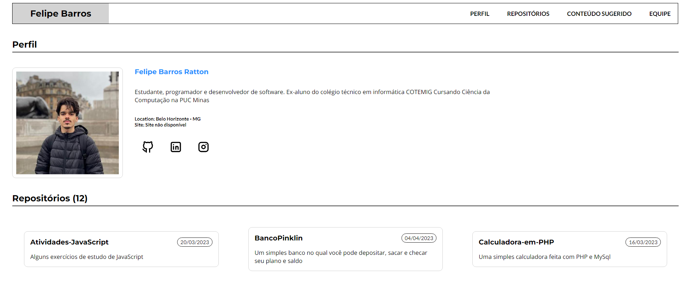
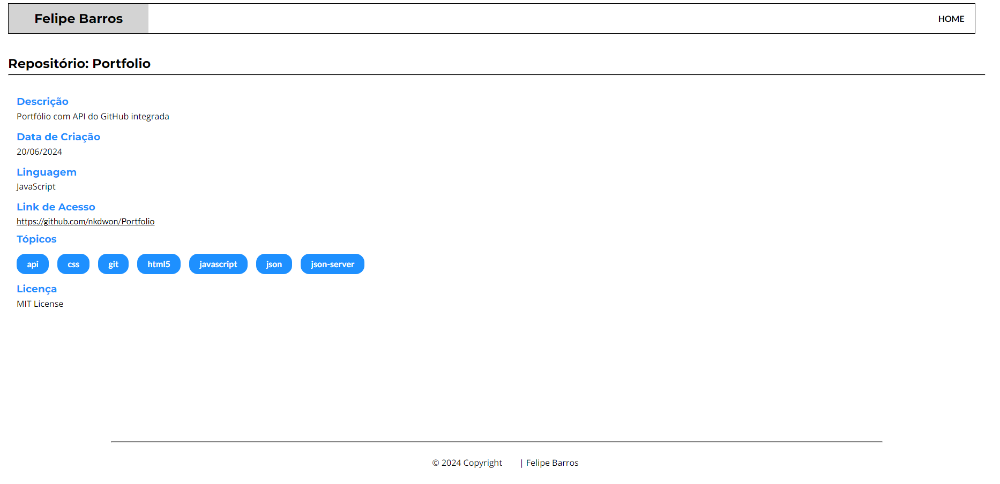

# Portfolio
Portfólio com API do GitHub integrada e JSON Server

Desenvolvido durante as aulas de Desenvolvimento de Interfaces Web na faculdade PUC Minas

<h1 align="center"> Portfólio API GitHub e JSON Server </h1>

Um portfólio responsivo desenvolvido com API do GitHub e JSON Server integrada, sob os ensinamentos das aulas de Desenvolvimento de Interfaces Web na faculdade PUC Minas
  

  <a href="#-tecnologias">Tecnologias</a>&nbsp;&nbsp;&nbsp;|&nbsp;&nbsp;&nbsp;
  <a href="#-preview">Preview</a>&nbsp;&nbsp;&nbsp;|&nbsp;&nbsp;&nbsp;
  <a href="#-projeto">Projeto</a>&nbsp;&nbsp;&nbsp;|&nbsp;&nbsp;&nbsp;

---

 

## 🚀 Tecnologias

Esse projeto foi desenvolvido com as seguintes tecnologias:

- HTML e CSS
- JavaScript
- Node.js
- JSON Server
- Git e Github
- Postimage

## 🚩 Preview 

<h3 align="center"> Layout Web 💻 </h3>

 

  

##

  

## 📁 Projeto

- Para o funcionamento total do projeto, é necessário que você baixe o projeto e tenha o Node.js instalado em sua máquina.

- Após a instalção, utilize o comando npm start no terminal do VS Code, assim, inicializando o JSON server para trazer de sua API os dados da página.

- Após que fazer isso, você pode acessar o endereço da máquina (http://localhost:3000/) e ver o projeto ou, você também pode acessar o projeto já online e agora completo [aqui!](https://nkdwon.github.io/Portfolio/felipe_almeida_732683/public/index.html)

- Caso não tenha o Node.js instalado, consulte este [vídeo](https://www.youtube.com/watch?v=64i9Jhn_lZc&t=190s). Se tiver dúvidas ou mais interesse em aprender sobre a ferramenta, acesse a documentação [aqui](https://nodejs.org/en/download/prebuilt-installer).

## 📝 Licença

Esse projeto está sob a licença MIT.

---
